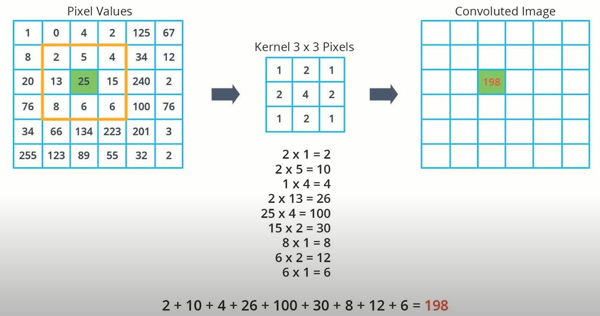
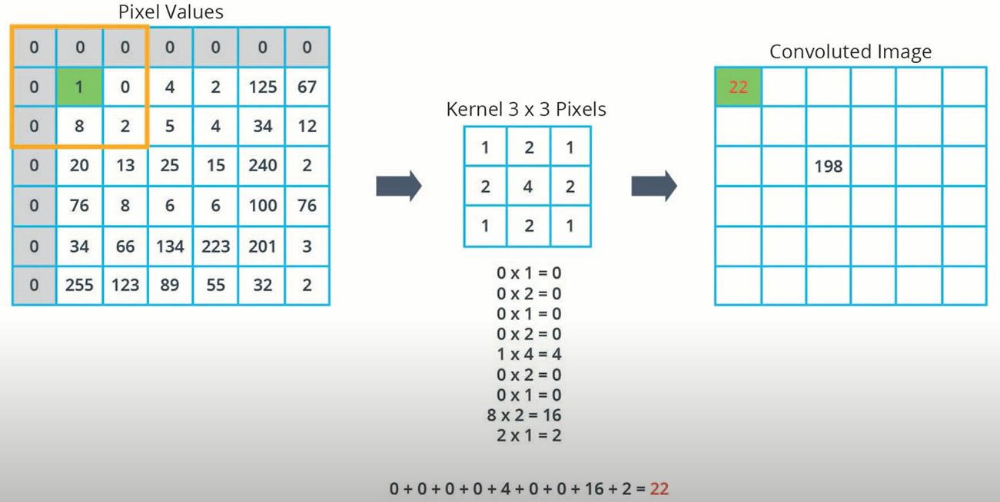
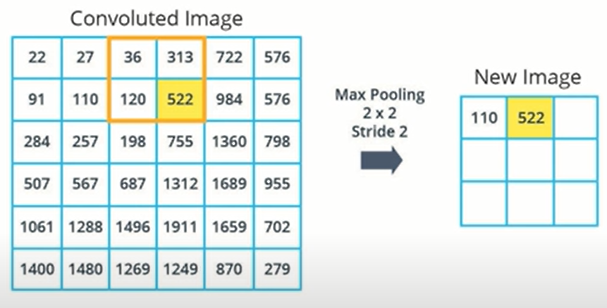

# machine_learning_03

Udacity course: https://classroom.udacity.com/courses/ud187

## Lesson 4: Introduction to CNNs
CNN = Convolutional Neural Network

Especially when applied to image classification, CNNs have higher accuracy than dense neural networks.

CNNs employ two main concepts:
* Convolutions
* Max pooling

### Convolutions
At a high level, kernel convolution is the concept of applying a "kernel" matrix to the input data.  The kernel matrix allows one pixel's value to be affected by its surrounding pixels in a weighted fashion.  For example:



Relative to a specific pixel, the neighboring pixels directly above, below, to the left, and to the right have 50% weight.  Then the pixels surrounding it diagonally have 25% weight.

Then for pixels on an edge, we use "zero padding" for the surrounding border:



Keras contains convolution layers for the purpose of applying this process.

### Max pooling
Max pooling is the concept of summarizing regions by selecting the pixels with the greatest value. 

For example, consider this input content:



We have a "grid" or "pool size" of 2x2.  Therefore, we are selecting the greatest value within a pixel area that is 2 pixels high and 2 pixels across.

Then the "stride" is the amount to move the "grid" between samples.  So with a stride of 2, we are moving across / down by 2 pixels each time.

Because the new image is smaller than the original image, we say that we've "downsampled" the original image.  The size depends on grid size and stride.

### Image Classification with Convolutional Neural Networks
See [Fashion MNIST with CNNs](https://colab.research.google.com/github/tensorflow/examples/blob/master/courses/udacity_intro_to_tensorflow_for_deep_learning/l04c01_image_classification_with_cnns.ipynb).

This is very similar to the what we saw previously for MNIST processing.  Last time, we used just:
* A flattening layer
* A dense layer with ReLU activation, to transform the data.
* A dense layer with SoftMax activation, to choose the best category.

To incorporate CNNs, we now include convolution layers and a max pooling layer.  The first convolution layer is created as follows:

```
layer1 = tf.keras.layers.Conv2D(32, (3,3) padding='same', activation=tf.nn.relu, input_shape=(28, 28, 1))
```

This uses a 3x3 kernel, and padding to keep the same image size.  The 32 indicates that we are generating 32 convoluted images from the 1 input image.

Next, we apply a max pooling layer:

```
layer2 = tf.keras.layers.MaxPooling2D((2,2), strides=2)
```

We then apply the same process again:

```
layer3 = tf.keras.layers.Conv2D(64, (3,3) padding='same', activation=tf.nn.relu, input_shape=(28, 28, 1))
layer4 = tf.keras.layers.MaxPooling2D((2,2), strides=2)
```

Then we apply the same flattening, ReLU, and SoftMax transforms.  So all together, the model is created as follows:

```
model = tf.keras.Sequential([
    tf.keras.layers.Conv2D(32, (3,3), padding='same', activation=tf.nn.relu,
                           input_shape=(28, 28, 1)),
    tf.keras.layers.MaxPooling2D((2, 2), strides=2),
    tf.keras.layers.Conv2D(64, (3,3), padding='same', activation=tf.nn.relu),
    tf.keras.layers.MaxPooling2D((2, 2), strides=2),
    tf.keras.layers.Flatten(),
    tf.keras.layers.Dense(128, activation=tf.nn.relu),
    tf.keras.layers.Dense(10, activation=tf.nn.softmax)
])
```

Previously with just dense layers, the prediction accuracy was 88%.  Now with convolution and max pooling, the accuracy is nearly 98%.

### ELI5 CNNs
See [A Comprehensive Guide to CNNs](https://towardsdatascience.com/a-comprehensive-guide-to-convolutional-neural-networks-the-eli5-way-3bd2b1164a53)

"The objective of the Convolution Operation is to extract the high-level features such as edges, from the input image. ConvNets need not be limited to only one Convolutional Layer. Conventionally, the first ConvLayer is responsible for capturing the Low-Level features such as edges, color, gradient orientation, etc. With added layers, the architecture adapts to the High-Level features as well, giving us a network which has the wholesome understanding of images in the dataset, similar to how we would."

### Next steps
* Lesson 5: Going Further with CNNs

## Sample Code
This sample code is just a copy & paste from the CoLab.

Perhaps a valuable future exercise would be to identify certain elements on map data.  For example, we could train a model to identify houses, cars, and trees.

Alternatively, it may be useful to create a handwriting recognition tool for my own writing.

### System Requirements

* Python 3.7
* Pip 20.1+
* Poetry 1.1.4+:
  * `pip install poetry`
* (*On Windows 7 or later*) [Microsoft Visual C++ Redistributable for Visual Studio 2015, 2017 and 2019](https://support.microsoft.com/help/2977003/the-latest-supported-visual-c-downloads)
  * Required by tensorflow.  [Details](https://www.tensorflow.org/install/pip#system-requirements).

### Project Setup
To setup the virtual environment, run:
  > `poetry install`

To execute the sample code, run:
  > `poetry run main`
